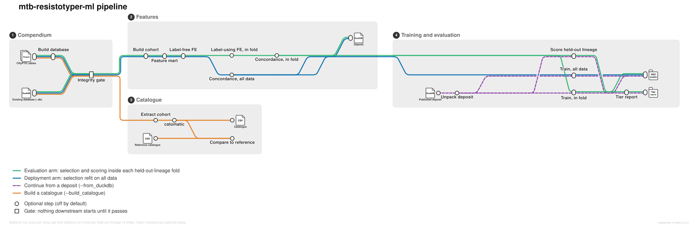

# mtb-resistotyper-ml-pipeline

Feature engineering, model training and catalogue construction for *Mycobacterium tuberculosis*
drug-resistance prediction, as two Nextflow pipelines.

```bash
# build the database from a CRyPTIC release (rarely)
nextflow run ./cryptic-db --cryptic_src /path/to/cryptic-tables-v3.4.0

# then engineer features and train (often)
nextflow run . -params-file experiments/baseline.yml

# or build a mutations catalogue from the same database, and nothing else
nextflow run . --build_catalogue true --db /path/to/cryptic.duckdb
```

## Three ways in

The entry workflow has three top-level branches, and a run takes exactly one of them. They are
branches rather than named workflows because Nextflow's strict parser refuses `-entry` and says
so: *"use a param to run a named workflow from the entry workflow"*.

| | flag | runs | stops before |
|---|---|---|---|
| **Train** | *(none)* | database → cohort → mart → FE → concordance → training → evaluation | nothing; this is the whole pipeline |
| **Continue from a deposit** | `--from_duckdb <file>` | training → evaluation, from published artefacts | the database build, FE and selection — unpacked, not recomputed |
| **Build a catalogue** | `--build_catalogue true` | database → cohort extraction → catomatic → comparison | FE, training and evaluation entirely |

The discipline each branch owes the others is to assign `channel.empty()` to every published
channel whose stage it skipped. A stage that ran and published nothing is indistinguishable, in
the output tree, from one that never ran; the empty assignment is what keeps the difference
legible and stops the workflow failing on an unassigned channel.

Each branch is documented below: training in the sections that follow, the deposit under
**The publishable artefact**, the catalogue under **Building a mutations catalogue**.



The map is derived from the workflow's own DAG, one stub run per branch; see
`docs/images/README.md` to regenerate it after changing the wiring.

### Testing the flow without running the work

Every process defines a stub, so any of the three branches can be exercised end to end in
seconds with no container, no database and no cluster:

```bash
nextflow run . -stub-run --db /dev/null --drugs RIF          # the training path
nextflow run . -stub-run --build_catalogue true --db /dev/null   # the catalogue path
```

What that catches is worth stating, because it is what has actually gone wrong here: a tuple
published to a path built from `r.drug`, both campaign arms fed into one channel, and manifests
paired by directory instead of by fold. All three are wiring faults, all three shipped, and all
three cost a full campaign to find — because the only route to the failure was to run the real
work first. A stub run reaches every one of them before a single task does any computing.

## The rule the pipeline exists to enforce

Every feature-engineering step declares whether it reads the phenotype label, and that
property alone decides where it may run.

| | runs | valid for |
|---|---|---|
| **label-free** — region filters, class filters, annotation joins | once, before the mart | every fold |
| **label-using** — association ranking, concordance selection | inside the training fold | that fold only |

Run a label-using step before the mart and it picks the column universe while looking at the
lineage held out for testing. `registry.assert_placement` refuses it, so a misplacement is a
configuration error rather than a mart that looks fine and is not.

That is not hypothetical. Concordance selection previously fitted on the whole mart —
`causal.py` said so in its own docstring — and every lineage-leave-one-out number in the
project was computed with features chosen while looking at the held-out lineage. Doing it
properly is 11 drugs × 4 lineages = 44 independent runs of an EBM, a causal forest and a
refutation pass: unaffordable in a loop on one machine, unremarkable distributed. That is what
this pipeline is for.

## An experiment is a params file

```bash
nextflow run . -params-file experiments/drop-pe-ppe.yml
```

Committing the file makes an experiment a reviewable artefact rather than a shell command
somebody remembers. Each varies exactly one thing against `baseline.yml`, owns its `outdir`,
and states its prediction in the header — a prediction written before the run is evidence, one
written after is a description. See `experiments/README.md`.

Sweeping several FE configurations against identical downstream folds:

```bash
nextflow run . --fe_configs conf/fe-sweep.example.csv
```

## Registered FE steps

```bash
python -m analysis.scripts.fe_steps.run_step --list --mart x --out y --steps x --phase pre-mart
```

| step | layer | phase | source |
|---|---|---|---|
| `region_filter` | universe | pre-mart | PE/PPE, ESX, IS/phage — measured population-structure proxies |
| `class_filter` | universe | pre-mart | mutation classes; synonymous is the measured lineage proxy |
| `callability_filter` | universe | pre-mart | Marin 2022 EBR/RLC low-callability regions |
| `rank_association` | rank | per-fold | chi² or mutual information on the binary label |
| `rank_mic` | rank | per-fold | Mann-Whitney effect on the graded MIC — Pei 2024 |
| `select_cross_model` | select | per-fold | random forest ∩ MLP top-N — Ghosh 2026 |

Adding one means writing a `run()` and calling `register()`. Nothing in `main.nf` changes,
because the workflow only ever passes a string and a phase.

## Storage on the abc cluster

Paths follow ADR-0060. **A project is a prefix in its group's bucket, never a bucket of its
own** — the shared pipeline cache and the workbench home are both keyed on the *group* bucket,
so a project bucket silently opts out of both.

```
s3://${MTB_GROUP_BUCKET}/
  references/cryptic/cryptic-slim.duckdb        curated, read-only, shared
  pipelines/mtb-resistotyper-ml/workdir         group-shared cache — runner-only
  users/abhi/results/<experiment>               visible as ~/abc/me/<group>/results/
```

`workDir` sits in the **group-shared** area on purpose. The deterministic resume session UUID
keys off that path, so a colleague re-running this pipeline reuses the work a previous run did
rather than repeating it. Put it under a user or a project and that sharing quietly stops.

Override any of it:

```bash
nextflow run . -profile nomad   --group_bucket su-other-group --user_prefix users/someone-else
```

MinIO credentials come from the environment, never the repository, and the **API port is
`:9000`** — not the console `:9001`:

```bash
export AWS_ACCESS_KEY_ID=...  AWS_SECRET_ACCESS_KEY=...  ABC_MINIO_ENDPOINT=...
nextflow run . -profile nomad -params-file experiments/baseline.yml
```

## Profiles

| profile | what it does |
|---|---|
| `standard` | local, no containers, the virtual environments on your machine |
| `containers` | local Docker, using the three images |
| `nomad` | the abc cluster, containers required |
| `test` | one drug, one lineage, short H2O runtime |

## Containers

Four images, because the stacks are mutually exclusive — `econml`/`dowhy` pin numpy 1.x while
this project's H2O environment is numpy 2.x, and `mtb-catomatic` carries a catalogue builder
the other three never call. See `containers/README.md`. Each image carries
`analysis/` at `/opt/mtb`, which is what lets this repository stay pure Nextflow: a Nomad task
needs no shared filesystem and no checkout to find its scripts.

**The consequence to remember:** changing an analysis script means rebuilding the image. The
workflow is versioned by its git tag, the analysis code by the image tag, and the two are
joined in `nextflow.config`.

## Building a mutations catalogue

`--build_catalogue true` builds a catalogue with [catomatic](https://github.com/fowler-lab/catomatic)
and **stops**. It runs no feature engineering, no training and no evaluation: a catalogue build
should not pay for stages that answer a different question. It is a third top-level branch
alongside `--from_duckdb` and the full path.

```bash
nextflow run main.nf -profile containers \
    --build_catalogue true \
    --db /path/to/cryptic.duckdb \
    --catalogue_drugs RIF,BDQ \
    --catalogue_reference /path/to/MTBC-CRyPTICv1.1.1-2025.8.csv
```

Output lands in `catalogues/<cohort-tag>/<drug>/frs-<threshold>/`: the piezo CSV, the JSON
catalogue, a build manifest, and — when a reference is given — the comparison.

The reference catalogues live in group storage rather than in this repository:
`references/catalogues/MTBC-CRyPTICv1.1.1-2025.8.csv` (and the v3.4.0 edition), with a
`PROVENANCE.json` recording source, checksums and fetch date. `fowler-lab/cryptic-catalogues-2025`
declares **no licence**, so they are used here and not redistributed. **Match the reference to
the cohort, not to the database:** a build over the `CRyPTIC-v1.0` tag compares against the
v1.1.1 catalogue even when the database is v3.4.0.

### Four things that will silently produce the wrong catalogue

Each of these was found by checking a real build against published figures, and each returns a
plausible catalogue rather than an error. The defaults are set so that none of them is the
default, and the extraction refuses rather than guesses.

**The phenotype source is `dst_measurements`, not `ukmyc_phenotypes`.** Both carry a binary
call. On the `CRyPTIC-v1.0` cohort the first yields 39,402 phenotyped samples and the second
12,324. `ukmyc_phenotypes` is the MIC-plate reading the feature marts use; the DST phenotype is
what the published catalogues are built on. `--catalogue_phenotype_source` selects, so a
comparison between them is a run rather than a rewrite.

**FRS is mostly null, so FRS filtering is off.** The column is populated for 10.19% of mutation
rows in the v3.4.0 build and 0.33% in v2.1.2. `FRS >= 0.9` takes rpoB from 78,542 rows to 60 and
still returns a catalogue. `--catalogue_frs` is `null` by default and the extraction refuses a
threshold below 50% coverage unless `--allow-sparse-frs` is passed. catomatic has its own
`--frs`; the filtering is done at extraction instead because only there can the run report how
much of the data carried an FRS value at all.

**Restrict the genes.** Unrestricted, a build grades all 1,801 genes the cohort carries,
including the PE/PPE families no catalogue entry mentions. `--catalogue_genes` defaults to the
genes named in the original publications: `RIF:rpoB;BDQ:Rv0678,atpE,pepQ`.

**The cohort is a release tag, not a sample list.** `wgs_samples.dataset = 'CRyPTIC-v1.0'`
recovers 39,545 samples, 39,402 of them phenotyped, against the 39,358 the catomatic paper
reports — a +44 (0.11%) QC-definition difference. Only the v3.4.0 build publishes that column;
against v2.1.2 the extraction fails with that explanation rather than building from an
unfiltered cohort.

Samples carrying contradictory phenotypes for the same drug (271 of them for rifampicin) are
dropped and counted, not resolved by an unstated rule.

## The publishable artefact

Two optional flags turn the pipeline into something a reader can pick up without the cluster.

**Depositing.** `--create_duckdb` writes one self-contained DuckDB holding the state of the
data after feature engineering and before training: every mart, every concordance selection,
the per-fold selection manifests, and a `marts_index` in which `cryptic_version`, `mart_version`
and `catalogue` are first-class columns, so a reader can tell a CRyPTIC 2.1.2 mart from a 3.4.0
one without opening a manifest. Nothing downstream reads it — `TRAIN_H2O` still takes the mart
and the selection directly — so enabling the flag changes what is deposited, never what is
computed.

```bash
nextflow run . -profile nomad --create_duckdb
```

**Continuing from a deposit.** `--from_duckdb <file>` skips the compendium, the thirteen-stage
build, feature engineering and causal selection, unpacks their results back into the parquet and
JSON layout the training stages already expect, and starts at training. This is how somebody
resumes from the Zenodo deposit without the cluster or the twelve hours that produced it.

```bash
nextflow run . -profile standard --from_duckdb mtb-resistotyper-fe.duckdb
```

Two details worth knowing:

- The deposit holds **both campaign arms**, and they are not interchangeable. Units with a
  held-out lineage carry a selection made inside that training fold and feed evaluation only;
  the `none` unit carries a selection refit on all data and feeds the shipped model only. The
  branch separates them, because crossing them would produce deployment models fitted on
  fold-restricted features and a "held-out" score computed on rows whose features already saw
  them.
- A deposit rerun does **not** redo feature engineering, so this run's `fe_*` settings do not
  describe the mart — only `--fe_name` is used, as a grouping label for the tier report.

There is no `-entry` for this. Nextflow's strict parser refuses the option outright and says to
drive a named workflow from a parameter instead, so both paths live in the one entry workflow.

## Licence

EPL-2.0.
